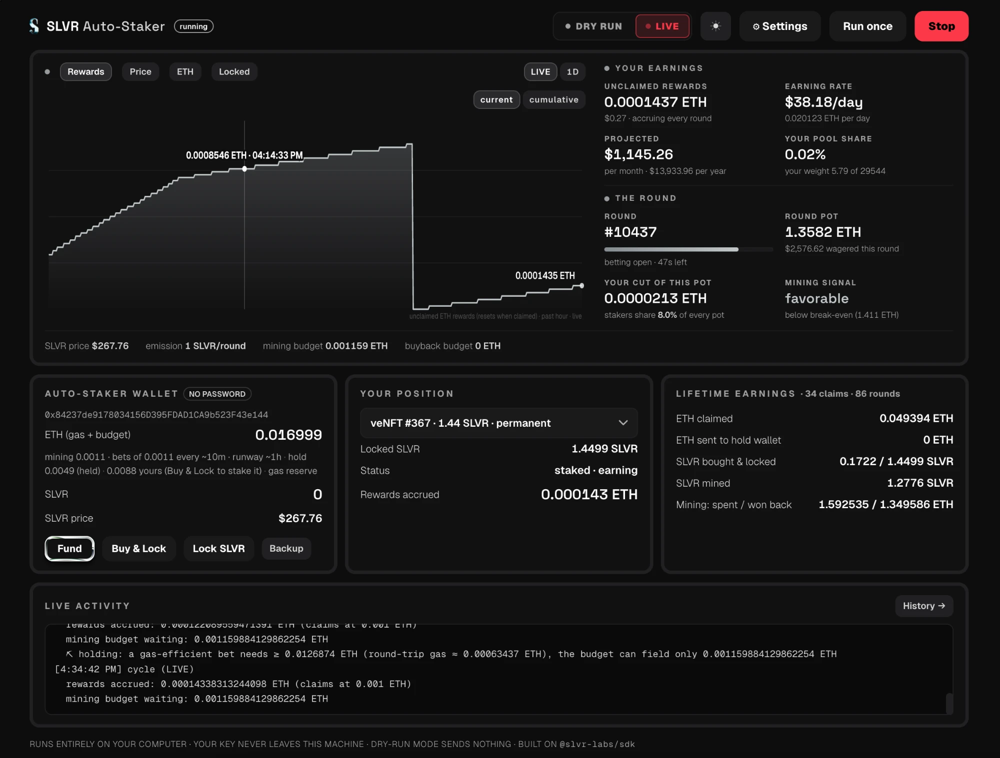

# SLVR Auto-Staker

A small app with a **simple web UI** that you run on your own computer and that
takes care of your SLVR staking position for you. You create a locked
position with an amount **you choose** (the **Buy & Lock** or **Max-lock**
button), then it compounds your **claimed rewards** for you. While running,
it automatically:

1. **Claims the ETH rewards** your staked veNFT earns
2. Splits every claim three ways, by percentages you pick in the UI:
   - **HOLD** — sent to a wallet you choose (or kept in the running wallet)
   - **MINE** — small, spread-out bets in the grid game that earn SLVR
     (only when the round is estimated to be profitable **after gas**)
   - **BUYBACK** — buys SLVR on the market and **max-locks** it, growing your
     position so it earns more next time (compounding)

By default the **auto allocation** mode skips the fixed split for the
mine/buyback share and routes it to whichever pays right now: mining while
rounds are profitable net of gas, buybacks otherwise.

**Your wallet balance is never auto-spent.** Mining and buybacks are funded
only by your claimed rewards; the ETH and SLVR in the wallet are your
principal (plus a small gas reserve) and stay put unless *you* click a button.
To create or grow your locked position you use **Buy & Lock** (spend a
chosen amount of wallet ETH to buy SLVR and permanently lock it) or
**Max-lock** (lock SLVR you already hold) — importing a funded wallet will
never convert or lock your balance on its own. A small local database tracks
lifetime earnings, every action taken, and how your rewards accrue over time.

Your private key stays in a file on your computer. Nothing is sent anywhere
except signed transactions going straight to Robinhood Chain.

Built on the official [`@slvr-labs/sdk`](https://www.npmjs.com/package/@slvr-labs/sdk).

---

## ⚠ Disclaimer

**Use at your own risk.** This is open-source example software provided
"as is", without warranty of any kind. It is not financial, investment, or
tax advice, and nobody involved in building it is your fiduciary.

- It automates real transactions with real funds on a live blockchain.
  Smart contracts can have bugs, markets move, mining is probabilistic
  betting, and **max-locked SLVR is burned permanently and can never be
  withdrawn**. You can lose some or all of what you deposit.
- **You are solely responsible for your keys.** If you lose the wallet
  file, the recovery file, and the private key, your funds are gone —
  no one can recover them for you.
- Only deposit what you can afford to lose. Start small, run in dry-run
  first, and read what the Live Activity feed says before going LIVE.

## Before you deposit — the 2-minute checklist

1. **Set a password** during setup (encrypts your key on disk).
2. **Download the recovery file** and confirm you can find it. This single
   file restores your account on any machine.
3. **Fund with a small amount first** — a few dollars of ETH. Watch a
   dry-run cycle, then a LIVE cycle, before adding more.
4. Know where your data lives (shown in Settings → General) —
   deleting that folder without a backup deletes the wallet.

---

## What you need before starting

- **Node.js** v22.13 or newer — download the "LTS" version from
  [nodejs.org](https://nodejs.org) and install it like any normal app
- Some **ETH** (for gas + mining) and optionally **SLVR** to fund the
  auto-staker with — the built-in **Fund** button moves both over from your
  regular wallet (MetaMask etc.)

You don't need to export keys from your main wallet: the app can **create its
own fresh wallet** for the automation, which is the recommended setup — fund
it with only what the automation should manage.

## How to run it

**Mac:** double-click `start.command`.
*(If macOS blocks it the first time: right-click → Open → Open.)*

**Windows:** double-click `start.bat`.

**Terminal folks:** `npm install` then `npm start`.

### The easiest way: let Claude run the whole thing

Open Claude Code anywhere and paste this one prompt:

> Set me up with the SLVR auto-staker from
> https://github.com/slvr-fun/Auto-Staker — if my GitHub CLI is
> logged in, fork it and clone my fork; otherwise just clone it; and if
> git isn't installed on this machine, download
> https://github.com/slvr-fun/Auto-Staker/archive/refs/heads/main.zip
> and unzip it instead. Put it in a folder called slvr-autostaker, install
> it, start it, and open the dashboard. From now on I'll manage it through
> you.

That's the whole setup. Afterwards, everything is plain English in Claude —
no terminal, no git knowledge needed:

- "start the auto-staker" / "stop the auto-staker"
- "check on the auto-staker" — is it running, earning, any problems
- "change my split to 20/40/40" or "raise the max bet per round"
- "write me a mining strategy that only plays quiet rounds"
- "upgrade the auto-staker" — pulls the latest template improvements while
  preserving your settings, wallet, and customizations. **Upgrades work for
  every install method**: forks and clones merge via git, and zip installs
  are upgraded from a fresh zip download — no GitHub account or git
  required, ever.

The bundled skills (`.claude/skills/`) teach Claude how to do all of this
safely — including the hard rules: never touch your wallet or data, keep
dry-run the default, verify every change.

The app opens **http://localhost:4663** in your browser, where a short
**setup wizard** walks you through everything:

1. **Wallet** — create a fresh one, paste the key of an existing account,
   or restore a recovery file from a previous setup.
2. **Password** (recommended) — the key is stored encrypted on disk and the
   app asks to unlock it each time it starts.
3. **Back it up** — download the **recovery file** (safe to store anywhere
   if you set a password) or view the private key once to write down. If
   your computer dies, either one recovers the account on a fresh clone of
   this repo.
4. **Fund it** — connect your regular browser wallet (MetaMask etc.); the
   app switches it to Robinhood Chain and sends ETH and/or SLVR over, then
   tracks each deposit to confirmation and updates the balance. Funds on
   another chain? The Fund modal **bridges from Ethereum, Arbitrum, Base,
   Optimism, or Polygon** (via Relay — usually under a minute, quote shown first)
   with live status until it lands. No extension? Copy the address and send
   from anywhere — or skip and use the Fund button later.
5. **Split** — drag the sliders (hold / mine / buy-and-lock); they always
   add up to 100%.

Then on the dashboard, create your position with an amount **you choose**:
click **Buy & Lock** to spend a set amount of wallet ETH on SLVR and
permanently lock it (or **Max-lock** to lock SLVR you already hold). This is
the only step that spends your principal, and you pick exactly how much — the
automation never converts your wallet balance on its own. Once you have a
position, press **Start** and it claims and compounds your rewards. The
dashboard itself is a live monitor — a real-time
chart of your accruing rewards (readings every 30 seconds), the current
round and pot, balances, lifetime earnings, and the activity feed. All
configuration lives behind the **⚙ Settings** button: the claim split, the
mining strategy, and General options — including a **custom RPC endpoint**.
The public Robinhood Chain RPC works out of the box, but a free private
endpoint from [Alchemy](https://www.alchemy.com/) or
[Chainstack](https://chainstack.com/) is noticeably faster and more
reliable — create an account, add the Robinhood Chain network, and paste
the HTTPS URL into Settings → General.

**Start in dry-run.** The **DRY RUN / LIVE** switch sits right in the header:
in dry-run the app connects to the real chain and shows exactly what it
*would* do in the Live Activity panel, but sends nothing. Flip to LIVE when
you're comfortable — it asks you to confirm. The app also warns loudly when
the wallet is running low on gas.

## Stopping, restarting, and moving machines

Everything the app knows lives in four small files in your computer's
standard app-data folder — outside the code, so re-cloning or upgrading the
repo never touches it:

- **macOS**: `~/Library/Application Support/slvr-autostaker`
- **Windows**: `%APPDATA%\slvr-autostaker`
- **Linux**: `~/.local/share/slvr-autostaker`

(The exact path shows in Settings → General.) The app **resumes
from these files automatically**:

- Close the window, reboot, or crash — the next launch picks up exactly
  where it left off. If the automation was running, it starts again by
  itself (password-protected wallets resume the moment you unlock).
- Press **Stop** and it stays stopped, including across restarts, until you
  press Start again.
- New computer? Clone this repo, run it, and use **Restore from a recovery
  file** in the wizard — the account, and your settings once saved, come
  back.

Nothing happens while the app is closed; rewards simply keep accruing
on-chain until the next time you start it.

Works the same on **macOS** (`start.command`), **Windows** (`start.bat`),
and Linux (`npm start`) — no native modules, so `npm install` never needs a
compiler.

## Commands

| Command | What it does |
|---|---|
| `npm start` | Launch the web UI at http://localhost:4663 |
| `npm run status` | Terminal summary: wallet, position, lifetime earnings |
| `npm run once` | Run a single automation cycle in the terminal |
| `npm run check` | Quick no-wallet test that everything is installed |

## How mining works (and the strategy tab)

"Mining" means betting ETH in the SLVR grid game — every bettor earns newly
minted SLVR in proportion to their share of the pot. The app spreads each
mining bet across **all 25 squares**, so it always holds the winning square
and can always claim.

Mining is only worth it while the round's pot is small; once the pot gets
big, the protocol fee outweighs the SLVR you'd mine.

**Gas is part of the math.** A 25-square bet is gas-heavy, so the app
handles gas as a first-class cost:

- Every EV estimate is **net of gas** — "profitable" means profitable after
  the bet + claim transactions are paid for.
- Bets have a **gas-based minimum size** (recomputed from the live gas
  price) so gas can never eat more than a few percent of a stake, and the
  budget **paces itself to last until the next claim tops it up** — so the
  miner stays in the game continuously instead of burning the budget in a
  burst. Top up the wallet and the per-round size adapts on the next round.
- **Mining pace** (Settings → Mining) controls how the budget is split:
  *fewer, larger bets* (lowest gas drag, less frequent), *balanced*
  (default), or *more, smaller bets*. Larger bets dilute the fixed gas cost;
  either way the budget lasts until the next claim. Mining lives in its own
  module (`src/mining.ts`) if you want to customize the sizing further.
- If network gas **spikes** well above normal, mining pauses entirely and
  new funds route to buybacks until gas settles.
- The very first bet from a wallet also pays the grid game's **one-time
  account-opening fee** (~0.0001 ETH, read live from the contract) — the feed calls it out so it doesn't
  look like a mystery charge.

Each strategy has a short explanation (hover it in Settings → Mining) and
its own tunable parameters that appear below the picker when selected — e.g.
Opportunistic exposes its target edge, patience, full-size edge, and max
bet multiple.
Custom strategies in `strategies.custom.ts` can declare their own description
and params too (see `CUSTOM_MINING_META`).

The **Mining strategy** tab lets you customize exactly when the miner plays:

- **EV-gated** (recommended, default): uses the SDK's expected-value math
  every round, and holds your budget until a round qualifies. Off = bet
  every round the budget allows.
- **Opportunistic** (optimize for profitability): holds out for
  higher-edge rounds and **bets more when the edge is bigger** (up to 3x the
  base stake, capped by your Max ETH per round). The patience bar starts high
  and relaxes over a few hours, so a quiet market never freezes the budget.
  Pick it from the strategy row in Settings → Mining.
- **Minimum edge** — require the estimated profit to be at least X% of the
  stake (e.g. `2` = only rounds worth ≥ 2% of what you put in). `0` takes
  any profitable round.
- **Max pot size** — a hard cap: never enter rounds whose pot is already
  above X ETH, whatever the EV says.
- **Max ETH per round** and a **betting-window guard** (skip rounds about to
  close).
- **Hold vs cash-out valuation** — value mined SLVR at full price (you'll
  keep/stake it) or net of the 10% refining fee (you'll sell it for ETH).

Buybacks have a brain too: **Smart buybacks** (Settings → Claim split) hold
the buyback budget and buy **into sell pressure** — only when the price dips
below its recent average, in capped slices, with a max-wait valve so the
budget never sits forever. Off by default (instant buys).

Every skipped round shows its reason in the Live Activity panel, so you can
watch the strategy make decisions in dry-run before going live.

## Safety notes

- **Your key never leaves your machine.** It's stored in `wallet.json` in
  your app-data folder (see above — outside the repo entirely), and the UI
  server only listens on `localhost` — nothing is reachable from outside
  your computer.
- **Use the password option.** With a password set, the key is encrypted
  (AES-256-GCM, scrypt-derived) and only ever decrypted in memory while the
  app runs. Without one, `wallet.json` holds the key in plain text — same
  trust model as a `.env` file.
- **Keep the recovery file.** The Recovery file button downloads your
  wallet file (encrypted if you set a password). Restoring it on any fresh
  clone of this repo — via the wizard's "Restore from a recovery file" —
  brings the account back. Revealing the raw key always requires the
  password.
- **Dry-run first.** Watch a few cycles in the Live Activity panel before
  going live.
- **A gas reserve is always kept** (0.002 ETH) — every spending path (hold
  transfers, buybacks, mining bets) is capped so the app can't drain the
  wallet to zero and strand itself without gas.
- **Max-locking is permanent.** Max-locked SLVR is **burned** into your
  position — it earns ETH forever at the highest weight and can never be
  withdrawn. That permanence is the point; make sure you mean it.
- **Mining is still betting.** The EV check makes it statistically favorable,
  not guaranteed — individual rounds can lose ETH while earning SLVR.
- The app never unstakes, never withdraws your lock, and never sells SLVR.
  The only things it does with your money: claim rewards, send your HOLD
  share where you told it to, place mining bets, buy SLVR, and lock SLVR.

## Files this app creates

All of these live in the app-data folder listed above (per profile), never
in the repo:

| File | Contents | Safe to delete? |
|---|---|---|
| `wallet.json` | your private key (encrypted if you set a password) | **no** — deleting it loses the wallet unless you backed up the key |
| `config.json` | your split and settings | yes — redo setup in the UI |
| `state.json` | mining budget + unsettled rounds | only when the budget is 0 and no rounds are open |
| `data.sqlite` | earnings history & metrics | yes, but you lose the history view |

## FAQ

**Does my computer need to stay on?**
Only while you want the automation active. Rewards accrue on-chain
regardless; the app just claims and reinvests them when it's running.

**Can I change my split later?**
Any time — edit the numbers in the UI and hit Save. Changes apply from the
next cycle.

**My lock expired — what happens?**
Only timed locks can expire — the app flags it in the UI. The Max-lock
button (permanent lock) never expires, so buyback compounding continues
uninterrupted.

**How do I get updates?**
In Claude Code, say "upgrade the auto-staker" — the `upgrade-autostaker`
skill pulls the latest template changes into your copy (even if you've
modified it), shows you the notes from `UPGRADES.md`, and verifies the app
still works. Your wallet and settings are never touched.

**Can I run more than one account?**
Yes — each profile gets its own wallet, settings, and history. Start with
`SLVR_PROFILE=trading npm start` (any name you like) and that run manages a
completely separate account. Default profile is `default`.

**Is this financial advice?**
No. It's an example automation for a position you already chose to hold. You
decide the split; the app just executes it.
